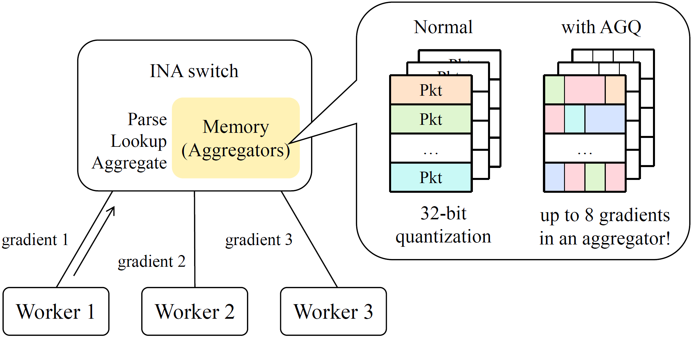

<h1 align="center">
   
  AGQ
   
</h1>

  <a href="#-key-features">Key Features</a> •
  <a href="#-get-started">Get Started</a> •
  <a href="#-license">License</a> •
  <a href="#-links">Links</a>

## 🎯 Key Features

* P4-based in-network aggregation scheme for distributed machine learning to support **A**daptive **G**radient **Q**uantization.
* **AGQ** can aggregate more gradients within the limited switch memory, therefore improving the total throughput among multiple training jobs.
* AGQ switch plugin has been open-sourced, including the  control logic in the data plane and packet generator with scapy for test.

## 🚄 Get Started

### 🕶️ Overview

The AGQ switch plugin offers a comprehensive INA solution for distributed machine learning. The figure below shows the mechanism of AGQ.  

In the existing INA approaches, the switch memory is conceptualized as an array of aggregators, where each aggregator can hold a 32 bit gradient. This limitation restricts the number of gradients that can be aggregated simultaneously to the total number of aggregators. 

With the incorporation of AGQ, as shown on the right side of the picture, it becomes possible to store multiple gradients of different lengths within a single register. This enhancement allows a switch to accommodate up to eight times more gradients in a register compared to previous capabilities, thereby significantly alleviating the memory bottleneck.

### ⚙️ Requirements

This repository has hardware and software requirements.

**Hardware Requirements**

* Our testbed evaluation is conducted on the tofino 1 switch with SDE 9.7.0.

**Software Requirements**

* Python: 3.8.10 (the same is best)
* scapy: 2.5.0 (the same is best)

> 🔔 In this document, all 'python' and 'pip' refer to the python version of 3.8.10.

## 📖 License

The project is released under the MIT License.

## 🔗 Links

Below are some links that may also be helpful to you:

- [P4lang](https://github.com/p4lang/)
- [scapy](https://scapy.readthedocs.io/en/latest/introduction.html)
- [switchML](https://github.com/p4lang/p4app-switchML/tree/main)
- [ATP](https://github.com/in-ATP/ATP)

